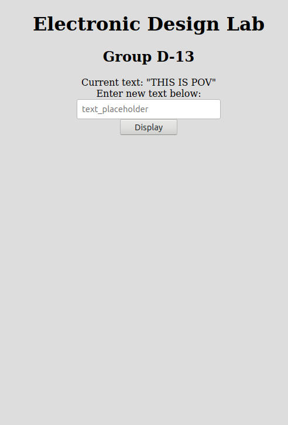

# EDL-POV-Display-Backend
This repository contains code for Electonic Design Lab Spring 19 project **Persistence of Vision** by group D-13.

   
   
ESP32 Text Server

### Team Members
- Mohd Safwan     - 17D0700470
- Aditya Khanna   - 17D070036
- Manas Vashistha - 17D070064

### Working
- The file should be uploaded to a ESP32 board. It sets up the host as a webserver where user can input text to display. It also displays the currently entered text.
- We have used the [SPI Flash File System](https://docs.espressif.com/projects/esp-idf/en/latest/esp32/api-reference/storage/spiffs.html) to read and write the input text in a file on local memory.

### To Do
- Parse the webserver input and send each character's corresponding signal to LED array.

### References
[1] [Random Nerd Tutorials](https://randomnerdtutorials.com/esp32-esp8266-input-data-html-form/)
